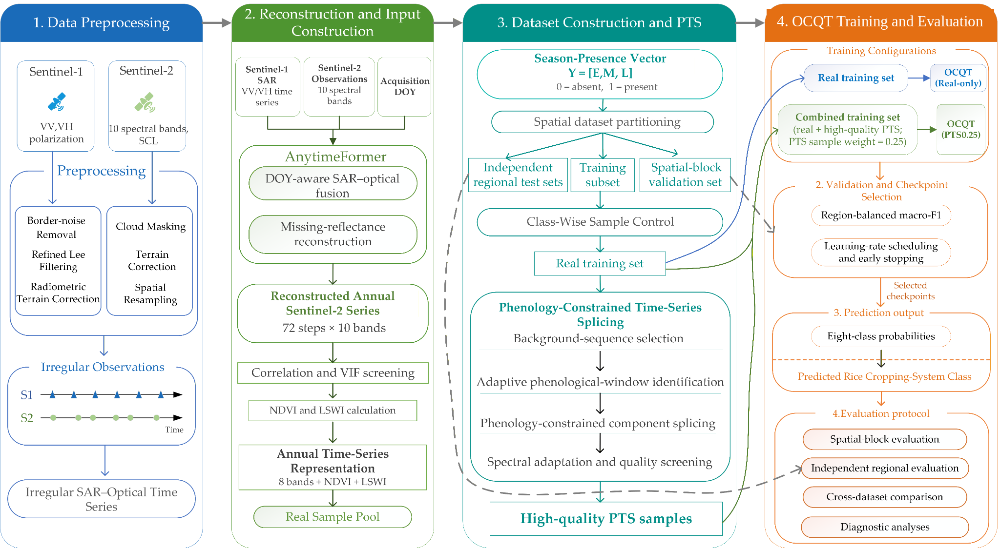

# Ordered-Cycle Query Transformer and Phenology-Constrained Time-Series Splicing

This repository provides the core implementations of the **Ordered-Cycle Query Transformer (OCQT)** and **Phenology-Constrained Time-Series Splicing (PTS)** for cross-regional classification of rice cropping systems based on within-year seasonal composition.

The accompanying study distinguishes eight classes defined by the presence or absence of early-, middle-, and late-season rice within a year. The repository contains the model architecture, the joint multi-task objective, and the PTS sample-construction implementation. It is a research-code release rather than a complete end-to-end remote-sensing processing pipeline.

## Method overview



OCQT represents each annual time series using one annual-global feature representation and up to three data-driven cycle representations ordered chronologically by peak time. The projected annual-global and ordered-cycle tokens are jointly encoded with a learnable classification token and three learnable season-query tokens.


The model produces:

- eight-class rice cropping-system logits;
- early-, middle-, and late-season presence logits; and
- rice-season-count logits for 0, 1, 2, or 3 rice-growing seasons.

PTS constructs synthetic annual rice time series for underrepresented rice cropping-system classes by recombining observed season-specific phenological components under adaptive-window, background-compatibility, continuity, physical-plausibility, and novelty constraints. Strictly screened **Core-A** samples are treated as high-quality PTS samples for training; **Core-B** samples are retained for quality diagnostics only.

## Repository structure

```text
OCQT-PTS/
├── ocqt_model.py                    # OCQT architecture
├── ocqt_objective.py                # Joint multi-task loss
├── pts_generator.py                 # PTS generation and quality screening
├── demo_forward.py                  # Minimal forward-pass smoke test
├── requirements.txt
├── CITATION.cff
├── DATA_AVAILABILITY_STATEMENT.md
└── docs/
    ├── overall_workflow.png
    ├── ocqt_architecture.png
    ├── study_sites.png
    ├── independent_test_regions.png
    └── cross_dataset_comparison.png
```

## Installation

Python 3.10 or later is recommended.

```bash
python -m venv .venv
source .venv/bin/activate          # Windows PowerShell: .venv\Scripts\Activate.ps1
pip install -r requirements.txt
```

## OCQT quick start

The public model implementation expects precomputed features:

- `annual_global_features`: `[batch, global_dim]`;
- `ordered_cycle_features`: `[batch, 3, cycle_dim]`;
- `cycle_quality`: `[batch, 3]`; and
- `cycle_mask`: `[batch, 3]`, where `True` marks a missing cycle position.

The manuscript implementation used a 38-dimensional annual-global representation and a 97-dimensional representation for each retained cycle.

```python
import torch

from ocqt_model import OrderedCycleQueryTransformer

model = OrderedCycleQueryTransformer(global_dim=38, cycle_dim=97)
model.eval()

batch_size = 4
outputs = model(
    annual_global_features=torch.randn(batch_size, 38),
    ordered_cycle_features=torch.randn(batch_size, 3, 97),
    cycle_quality=torch.rand(batch_size, 3),
    cycle_mask=torch.zeros(batch_size, 3, dtype=torch.bool),
)

print(outputs["class_logits"].shape)   # [4, 8]
print(outputs["season_logits"].shape)  # [4, 3]
print(outputs["count_logits"].shape)   # [4, 4]
```

Run the included smoke test with:

```bash
python demo_forward.py
```

### Joint training objective

`ocqt_objective.py` implements the objective used in the manuscript:

```text
weighted eight-class cross-entropy
+ 0.12 × weighted season-presence BCE
+ 0.08 × rice-season-count cross-entropy
+ 0.03 × class–season consistency MSE
```

The two reported configurations used the same architecture:

- **OCQT (Real-only):** real samples with sample weight 1.0;
- **OCQT (PTS0.25):** the same real samples plus all high-quality PTS samples, with sample weights 1.0 and 0.25, respectively.

Feature standardization and class-imbalance weights were fitted separately for the two configurations, as described in the manuscript.

## PTS input and execution

`pts_generator.py` reads a real-training NPZ file only. Validation samples and independent regional test samples must not be supplied.

Required or supported fields are:

| Field | Requirement | Description |
|---|---|---|
| `X` | required | Annual time series with shape `[N, 72, F]` |
| `DOY` or `DOY_input` | required | Day-of-year values with shape `[N, 72]`, or one shared 72-step vector |
| `class_id` or `Y` | required | Eight-class IDs or three-channel season-presence labels |
| `feature_names` | strongly recommended | Must allow B4, B8, B11, NDVI, and LSWI to be identified |
| `source_file` | optional | Source identifier used by the hierarchical window library |
| `source_index_in_file` | optional | Original sample index |
| `region_id` | optional | Region identifier; otherwise inferred where possible |

Configure paths through environment variables:

```bash
export RICE_PROJECT_ROOT=/path/to/project
export PTS6_REAL_TRAIN_NPZ=/path/to/real_training.npz
export PTS6_OUTPUT_ROOT=/path/to/pts_outputs
python pts_generator.py
```

PowerShell example:

```powershell
$env:RICE_PROJECT_ROOT = "D:\rice_project"
$env:PTS6_REAL_TRAIN_NPZ = "D:\rice_project\data\real_training.npz"
$env:PTS6_OUTPUT_ROOT = "D:\rice_project\outputs\pts_v6"
python pts_generator.py
```

Generation limits and debugging controls can also be supplied through the `PTS6_*` environment variables defined near the top of `pts_generator.py`. The manuscript-specific class-wise targets and observed screening outcomes are reported in the Supplementary Materials; the script defaults are configurable runtime values and should not be interpreted as the final retained sample counts.

## Reproducibility scope

This repository does **not** include:

- proprietary field-survey and manually interpreted reference samples;
- fitted feature scalers or class-imbalance weights;
- trained checkpoints;
- the complete Sentinel-1/Sentinel-2 preprocessing and AnytimeFormer reconstruction pipeline; or
- third-party reference datasets used only for supplementary cross-dataset comparison.

Consequently, the repository supports inspection and reuse of the core methods but does not reproduce the reported numerical results without the corresponding data, feature construction, fitted preprocessing parameters, and experimental splits.

## Figures

The `docs/` directory contains manuscript figures for method documentation, including the study sites, overall workflow, OCQT architecture, independent-test-region examples, and supplementary cross-dataset comparison.

## Citation

Citation metadata are provided in [`CITATION.cff`](CITATION.cff). The manuscript is currently under review; the final bibliographic citation and DOI should be added after publication.

## License

No software license is included in this release. Add an explicit license before publication if redistribution and reuse permissions are to be granted.
